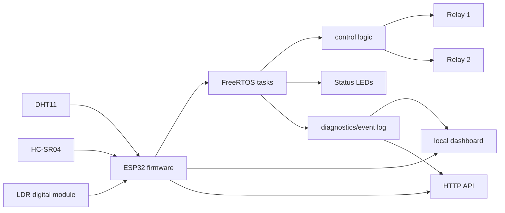
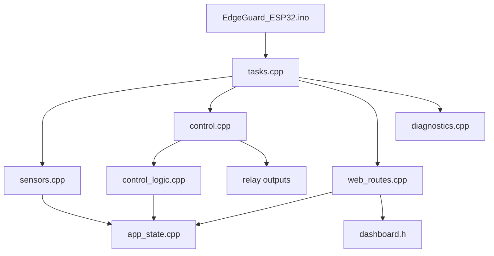
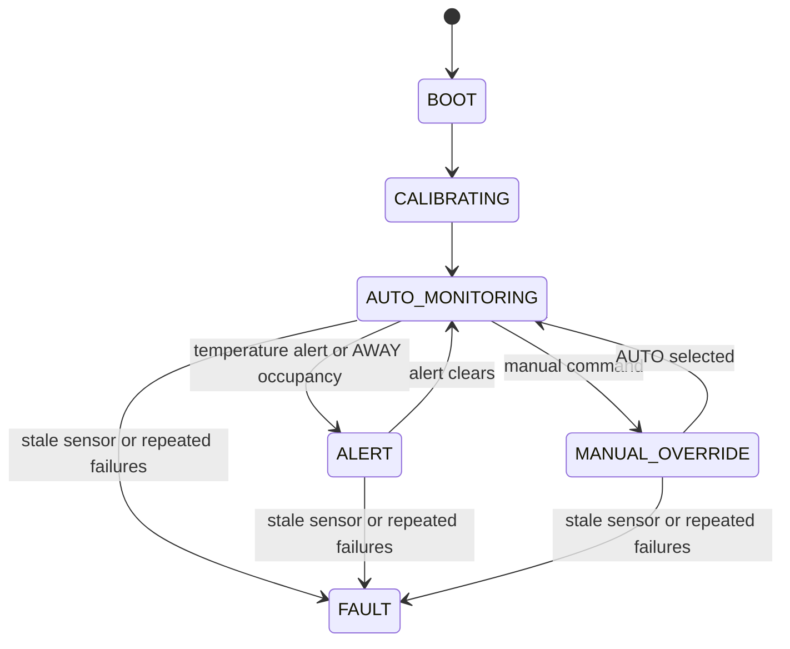

# EdgeGuard ESP32 RTOS Smart Room Node

A local-first ESP32 room-sensing and relay-control node built with Arduino-compatible firmware, FreeRTOS task separation, an onboard dashboard, HTTP API, diagnostics, and host-side control-logic tests.

[](https://github.com/AyushmanRaha/edgeguard-esp32-rtos-smart-room-node/actions/workflows/ci.yml)


[](LICENSE)

## Executive overview

EdgeGuard ESP32 RTOS Smart Room Node monitors a room with temperature, humidity, distance, and light sensors. It decides when low-voltage relay outputs should change, reports the current state through a local web dashboard, and exposes a compact HTTP API for local automation experiments.

The design is local-first: the ESP32 hosts the interface itself, so basic monitoring and control do not depend on external services. That makes the project useful for lab benches, classrooms, and offline prototyping where deterministic local behavior is more important than remote integrations.

## Key capabilities

| Capability | What it provides |
| --- | --- |
| Real-time room sensing | DHT11 temperature/humidity, HC-SR04 distance, and digital LDR readings. |
| Occupancy-aware relay control | Relay 1 turns on in AUTO only when the room is dark and occupancy is held. |
| Temperature alert hysteresis | Relay 2 follows a latched alert with separate on/off thresholds. |
| AUTO, MANUAL, and AWAY modes | Predictable behavior for autonomous, direct-command, and alert-oriented operation. |
| Local web dashboard | Browser view for mode, state, sensors, relays, IP, heap, and recent events. |
| HTTP API | Stable status, log, mode, and relay routes for local clients. |
| Fallback Wi-Fi access point | Dashboard remains reachable when station credentials are absent or unavailable. |
| FreeRTOS task separation | Sensor, control, web, and heartbeat loops run independently. |
| Watchdog and diagnostics | Heartbeats, reset reason, heap tracking, failure counters, and watchdog status. |
| Fail-safe relay behavior | Fault and stale-sensor paths force both relay outputs off. |
| Host-side unit tests | Pure control decisions are tested without physical ESP32 hardware. |

## Media placeholders

These media assets are intentionally listed as future capture targets instead of broken image links.

| Future asset | What it should show |
| --- | --- |
| `media/edgeguard_hero_build.jpg` | Full assembled prototype on a desk or breadboard with ESP32, sensors, relays, and LEDs visible. |
| `media/edgeguard_wiring_closeup.jpg` | Close-up wiring view showing GPIO connections, HC-SR04 divider, DHT11, LDR, relay channels, and LEDs. |
| `media/edgeguard_dashboard_status.png` | Browser dashboard with mode, state, sensor values, relay states, IP, heap, and event log. |
| `media/edgeguard_serial_monitor.png` | Serial monitor with boot messages, Wi-Fi or AP address, and periodic sensor logs. |
| Demo video | A release-hosted demo video link will be added later after safe capture and review. |

See [media capture guide](docs/media_guide.md) for framing, safety, and privacy checks.

## System overview



## Hardware

Core parts are an ESP32 DevKit board, DHT11 sensor, HC-SR04 ultrasonic module with ECHO level shifted to 3.3 V, digital LDR module, two low-voltage relay channels, and red/green status LEDs.

| Function | ESP32 GPIO | Notes |
| --- | ---: | --- |
| DHT11 DATA | 4 | Temperature and humidity data. |
| HC-SR04 TRIG | 5 | ESP32 output. |
| HC-SR04 ECHO | 18 | Use a voltage divider to protect the 3.3 V GPIO. |
| LDR DO | 34 | Digital input only. |
| Relay 1 | 26 | Active-low by default. |
| Relay 2 | 27 | Active-low by default. |
| Green LED | 23 | Normal heartbeat/status. |
| Red LED | 22 | Alert/fault indication. |

> Safety: this repository documents low-voltage DC prototyping only. Do not connect high-voltage loads to a breadboard or exposed relay module.

Detailed references: [hardware guide](docs/hardware.md) and [wiring table](hardware/wiring_table.md).

## Firmware architecture

The firmware remains Arduino IDE compatible by keeping the sketch and sibling modules in `firmware/EdgeGuard_ESP32/`. PlatformIO builds the same directory from the repository root.



`control_logic.cpp` is intentionally pure: it receives snapshots and memory, then returns a decision without reading hardware or writing GPIO. This seam makes the riskiest state decisions testable on a host computer. See [architecture](docs/architecture.md) and [design rationale](docs/design_rationale.md).

## Operating modes

| Mode or state | Behavior |
| --- | --- |
| AUTO | Relay 1 follows dark-and-occupied logic; Relay 2 follows the temperature alert latch. |
| MANUAL | API relay commands select direct relay states and state becomes `MANUAL_OVERRIDE`. |
| AWAY | Relay 1 remains off; instant occupancy enters `ALERT` and turns Relay 2 on. |
| FAULT | Stale sensor data or repeated sensor failures force both relays off. |

## State machine



## HTTP API quick reference

| Method | Route | Purpose |
| --- | --- | --- |
| GET | `/` | Dashboard. |
| GET | `/api/status` | Sensor, system, Wi-Fi, heap, and diagnostic status. |
| GET | `/api/logs` | Bounded event log as JSON array. |
| POST | `/api/mode/auto` | Select AUTO mode. |
| POST | `/api/mode/manual` | Select MANUAL mode. |
| POST | `/api/mode/away` | Select AWAY mode. |
| POST | `/api/relay1/on` | Relay 1 on and MANUAL mode. |
| POST | `/api/relay1/off` | Relay 1 off and MANUAL mode. |
| POST | `/api/relay2/on` | Relay 2 on and MANUAL mode. |
| POST | `/api/relay2/off` | Relay 2 off and MANUAL mode. |

Full route and field details are in [API documentation](docs/api.md).

## Dashboard

The local dashboard is served from `/` by the ESP32. It polls the status and log APIs, shows current mode/state, sensor readings, relay states, network details, heap information, and recent events, then provides buttons for mode and relay commands. The planned dashboard screenshot is `media/edgeguard_dashboard_status.png`.

## Build and flash

### 1. Prepare configuration

```bash
cp firmware/EdgeGuard_ESP32/secrets.h.example firmware/EdgeGuard_ESP32/secrets.h
```

Edit the local `secrets.h` only if station Wi-Fi is needed. Leave placeholders unchanged or omit the file to use fallback AP mode. Never commit `secrets.h`.

### 2. Arduino IDE workflow

Open `firmware/EdgeGuard_ESP32/EdgeGuard_ESP32.ino`, install ESP32 board support and the DHT dependencies, select an ESP32 DevKit target, set Serial Monitor to `115200`, and upload.

### 3. PlatformIO workflow

```bash
python -m pip install -r requirements.txt
pio run -e esp32doit-devkit-v1
pio run -e esp32doit-devkit-v1 -t upload
pio device monitor -b 115200
```

When station connection is not available, connect to fallback AP `EdgeGuard-ESP32` with password `edgeguard123` and open `http://192.168.4.1/`.

## Testing

Automated checks:

```bash
python tools/verify_repo.py
pio test -e native
pio run -e esp32doit-devkit-v1
```

Native tests cover AUTO, MANUAL, AWAY, stale-sensor fault handling, occupancy hold, temperature hysteresis, invalid distance readings, and boundary behavior in `computeControlDecision(...)`. Manual validation covers boot, sensors, relays, dashboard/API, AP fallback, and safe fail states. See [testing plan](docs/testing_plan.md).

## Continuous integration

CI performs repository verification, native unit tests, firmware build, and firmware artifact upload. The workflow uses least-privilege read permissions, dependency caching, Python 3.12, and explicit PlatformIO environments. See [CI details](docs/ci.md).

## Repository structure

```text
firmware/EdgeGuard_ESP32/        Arduino-compatible firmware modules and dashboard
hardware/wiring_table.md         Concise wiring reference
docs/                            Architecture, API, hardware, testing, CI, and rationale
test/native_stubs/               Minimal Arduino/FreeRTOS stubs for native tests
test/test_control_logic/         Host-side Unity tests for pure control logic
tools/verify_repo.py             Repository integrity and content-policy checks
.github/workflows/ci.yml         Verification, test, build, and artifact workflow
platformio.ini                   ESP32 and native PlatformIO environments
```

## Safety and limitations

- Low-voltage DC prototyping only.
- No cloud dependency.
- No built-in authentication; use trusted lab or isolated local networks.
- No OTA or MQTT in the current firmware; both are future extensions.
- Relay modules vary, so validate polarity with safe low-voltage loads only.

## Troubleshooting

Common issues include USB upload instability, fallback AP discovery, stale sensor faults, inverted LDR modules, inverted relay modules, DHT read errors, HC-SR04 no echo, dashboard refresh problems, and serial monitor settings. See [troubleshooting](docs/troubleshooting.md).

## Roadmap

- Enclosure-ready wiring diagram.
- Richer dashboard graphs.
- Optional MQTT bridge.
- Optional OTA update path.
- Authentication layer for non-lab networks.
- Additional host tests around API JSON builders where practical.
- Release demo video.

## Acknowledgements

This project uses the ESP32 Arduino ecosystem, PlatformIO, FreeRTOS concepts, Adafruit DHT library support, Arduino community resources, and open-source embedded tooling.

## License

See [LICENSE](LICENSE).
