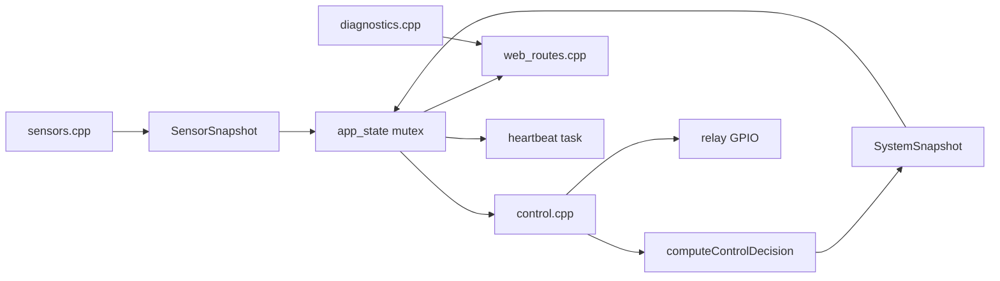

# Architecture

EdgeGuard is organized as a small embedded application with explicit seams between hardware I/O, shared state, decision logic, network routes, and diagnostics.

## Goals

- Keep Arduino IDE and PlatformIO builds using the same sketch directory.
- Keep sensor, control, web, and heartbeat work bounded and independent.
- Preserve conservative relay behavior when sensor data is unavailable or stale.
- Make core control decisions testable without ESP32 hardware.
- Expose clear local diagnostics through the dashboard and API.

## Non-goals

- Cloud telemetry, remote broker dependency, OTA, or external dashboard assets.
- High-voltage wiring guidance beyond safety warnings.
- Complex dynamic allocation patterns in time-sensitive paths.

## Module responsibilities

| Module | Responsibility |
| --- | --- |
| `EdgeGuard_ESP32.ino` | Minimal setup/loop entry point and startup ordering. |
| `config.h` | Pin map, thresholds, timeouts, task periods, stack sizes, and polarity constants. |
| `types.h` | Shared enums and snapshot structures. |
| `app_state.*` | Mutex-protected sensor/system snapshots and bounded event log. |
| `sensors.*` | DHT11, HC-SR04, and LDR reads with bounded ultrasonic timeout. |
| `control_logic.*` | Pure state, relay, occupancy, hysteresis, and stale-data decisions. |
| `control.*` | Relay GPIO setup/application and integration with shared snapshots. |
| `diagnostics.*` | Runtime metadata, task heartbeats, failure counters, heap, reset reason, and watchdog flag. |
| `wifi_manager.*` | Station connection attempts and fallback access point. |
| `web_routes.*` | Dashboard route, JSON response construction, and command endpoints. |
| `tasks.*` | FreeRTOS task loops and task creation checks. |
| `dashboard.h` | Embedded dashboard HTML/CSS/JavaScript. |

## Task model

| Task | Period or loop | Main work | Shared-state behavior |
| --- | --- | --- | --- |
| Sensor | `SENSOR_TASK_PERIOD_MS` | Read DHT11, HC-SR04, and LDR. | Publishes one complete `SensorSnapshot`. |
| Control | `CONTROL_TASK_PERIOD_MS` | Compute decision and apply relays. | Copies sensor/system snapshots, publishes updated system snapshot. |
| Web | Continuous server loop | Handles dashboard and API requests. | Copies state before JSON construction; commands update state through helpers. |
| Heartbeat | State-dependent period | Drives status LEDs. | Reads system state and diagnostics heartbeat. |

## Data flow

## Shared state model

Shared data is copied under a mutex, then used outside the critical section. This avoids holding the mutex during sensor reads, relay writes, serial output, network sends, or JSON assembly. If a critical state operation fails, command routes return `{"ok":false,"error":"state_unavailable"}` and control paths keep outputs conservative.

## Pure control logic seam

`computeControlDecision(...)` accepts the latest sensor snapshot, previous system snapshot, small control memory, and current time. It returns a decision with no GPIO, network, serial, or heap-dependent side effects. This keeps occupancy hold, temperature hysteresis, stale-sensor handling, AWAY alerts, and MANUAL preservation suitable for native unit tests.

## Fail-safe behavior

- Relays initialize off.
- Stale sensor snapshots enter `FAULT` and force both relays off.
- Repeated hardware read failures are tracked and integrated into conservative control behavior.
- AWAY mode never energizes Relay 1.
- MANUAL mode preserves existing relay states inside pure logic; direct command helpers apply requested outputs explicitly.

## Watchdog and diagnostics

Diagnostics track task heartbeats, sensor failure counters, heap values, reset reason, Wi-Fi reconnect state, RSSI where available, and whether the task watchdog was enabled. The dashboard and `/api/status` expose these values so runtime health can be checked without a debugger.

## Memory and heap considerations

The firmware uses bounded snapshots and a fixed-size event log. JSON strings reserve capacity before appending fields, and the dashboard is stored as program text. The API exposes both current free heap and minimum observed free heap to help catch regressions during manual validation.
