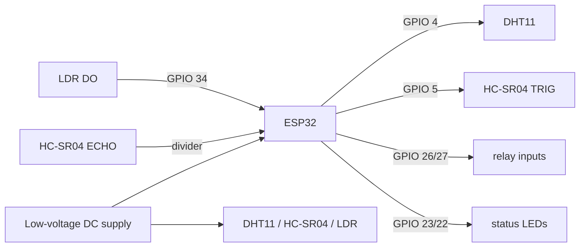

# Hardware Guide

## Component list

- ESP32 DevKit board targeting `esp32doit-devkit-v1` in PlatformIO.
- DHT11 temperature/humidity module.
- HC-SR04 ultrasonic distance module.
- Digital LDR module.
- Two low-voltage relay channels.
- Green and red LEDs with suitable resistors or LED modules.
- Jumper wires, breadboard, and a stable low-voltage DC supply.

## GPIO pin map

| Function | ESP32 GPIO | Electrical note |
| --- | ---: | --- |
| DHT11 DATA | 4 | Use normal module wiring and common ground. |
| HC-SR04 TRIG | 5 | ESP32 output. |
| HC-SR04 ECHO | 18 | Divide 5 V echo to 3.3 V before the ESP32 pin. |
| LDR DO | 34 | Digital input; GPIO 34 is input-only. |
| Relay 1 IN | 26 | `RELAY_ACTIVE_LOW = true`. |
| Relay 2 IN | 27 | `RELAY_ACTIVE_LOW = true`. |
| Green LED | 23 | Use a resistor or LED module. |
| Red LED | 22 | Use a resistor or LED module. |

## Wiring notes

Keep all sensor grounds common with ESP32 ground. The HC-SR04 ECHO pin is commonly 5 V and must not be connected directly to a 3.3 V ESP32 input. Use a resistor divider or suitable level shifter.

Most low-cost relay boards are active-low, so the firmware keeps `RELAY_ACTIVE_LOW = true`. Validate relay polarity with a safe low-voltage load. The LDR digital output polarity varies by module; this project assumes `LDR_DARK_WHEN_HIGH = true`.

## Power and safety

Use low-voltage DC prototyping only. Do not place high-voltage loads on a breadboard or exposed relay module. Relay coils and sensors can draw enough current to destabilize USB power; if uploads fail, disconnect external module power while the ESP32 is unpowered, upload, then reconnect the low-voltage circuit.

See the concise [wiring table](../hardware/wiring_table.md) for a quick reference.
